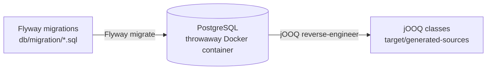

# jooq-meta-postgres-flyway

[](https://central.sonatype.com/artifact/com.github.sabomichal/jooq-meta-postgres-flyway)
[](https://github.com/sabomichal/jooq-meta-postgres-flyway/actions/workflows/maven.yml)

jOOQ code generation from Flyway migrations, against a real PostgreSQL. The generator
starts PostgreSQL in Docker (Testcontainers), runs your migrations with Flyway and then
reverse-engineers the result. No running database needed at build time, only Docker.



## Features

- **Real PostgreSQL**: the schema is built by the same engine that runs it in production,
  so extensions, custom types and PL/pgSQL work, unlike with jOOQ's `DDLDatabase`.
- **Plain Flyway migrations**: the ones your application already uses, with placeholders.
- **Your PostgreSQL version**: pick any image compatible with `postgres`.

## Setup

| Plugin  | jOOQ   | Java |
|---------|--------|------|
| `2.0.x` | 3.21.x | 21+  |
| `1.0.x` | 3.16.x | 11+  |

Flyway 10+ needs `flyway-database-postgresql` on the generator classpath next to the plugin.

### Maven

The plugin's dependencies need two overrides:

- `testcontainers`: `jooq-parent` pins `testcontainers` 1.20.6 in its `dependencyManagement`,
  which replaces the 2.x version the plugin needs (plugin `2.0.1` is built with `2.0.5`).
- `jackson-annotations`: `docker-java-api` (pulled in by Testcontainers) brings an older
  version, which breaks `jooq-codegen`.

```xml
<plugin>
    <groupId>org.jooq</groupId>
    <artifactId>jooq-codegen-maven</artifactId>
    <dependencies>
        <dependency>
            <groupId>com.github.sabomichal</groupId>
            <artifactId>jooq-meta-postgres-flyway</artifactId>
            <version>2.0.1</version>
        </dependency>
        <dependency>
            <groupId>org.flywaydb</groupId>
            <artifactId>flyway-database-postgresql</artifactId>
            <version>${flyway.version}</version>
        </dependency>
        <!-- jooq-parent pins testcontainers 1.20.6 -->
        <dependency>
            <groupId>org.testcontainers</groupId>
            <artifactId>testcontainers</artifactId>
            <version>${testcontainers.version}</version>
        </dependency>
        <!-- docker-java-api brings an older version that breaks jooq-codegen -->
        <dependency>
            <groupId>com.fasterxml.jackson.core</groupId>
            <artifactId>jackson-annotations</artifactId>
            <version>2.22</version>
        </dependency>
    </dependencies>
    <executions>
        <execution>
            <id>jooq-codegen</id>
            <phase>generate-sources</phase>
            <goals>
                <goal>generate</goal>
            </goals>
            <configuration>
                <generator>
                    <database>
                        <name>com.github.sabomichal.jooq.PostgresDDLDatabase</name>
                        <inputSchema>public</inputSchema>
                        <includes>public.*</includes>
                        <excludes>flyway_schema_history</excludes>
                        <properties>
                            <property>
                                <key>locations</key>
                                <value>src/main/resources/db/migration</value>
                            </property>
                        </properties>
                    </database>
                    <generate>
                        ...
                    </generate>
                </generator>
            </configuration>
        </execution>
    </executions>
</plugin>
```

### Gradle

With the official [jOOQ Gradle plugin](https://www.jooq.org/doc/latest/manual/code-generation/codegen-gradle/):

```groovy
plugins {
    id "org.jooq.jooq-codegen-gradle" version "3.21.2"
}

dependencies {
    jooqCodegen "com.github.sabomichal:jooq-meta-postgres-flyway:2.0.1"
    jooqCodegen "org.flywaydb:flyway-database-postgresql:12.4.0"
}

jooq {
    configuration {
        generator {
            database {
                name = "com.github.sabomichal.jooq.PostgresDDLDatabase"
                inputSchema = "public"
                includes = "public.*"
                excludes = "flyway_schema_history"
                properties {
                    property {
                        key = "locations"
                        value = "src/main/resources/db/migration"
                    }
                }
            }
        }
    }
}
```

## Properties

All optional. Each one is a separate `<property>` of the `<database>` element.

| Key                                    | Default       | Description                                                                                     |
|----------------------------------------|---------------|-------------------------------------------------------------------------------------------------|
| `locations`                            | *(empty)*     | Comma-separated migration directories, relative to the project directory.                       |
| `dockerImage`                          | `postgres:18` | Any image compatible with `postgres`, e.g. `postgis/postgis:17-3.5`.                            |
| `databaseName`                         | `jooqdb`      | Name of the database created in the container.                                                  |
| `defaultSchema`                        | `public`      | Schema Flyway migrates and keeps its history table in.                                          |
| `placeholders`                         | *(empty)*     | Flyway placeholders as comma-separated `key=value` pairs: `a=1,b=2`.                            |
| `initSql`                              | *(none)*      | SQL Flyway runs on each new connection, e.g. `SET search_path TO public;`.                      |
| `flyway.postgresql.transactional.lock` | `true`        | PostgreSQL transactional lock, see [flyway#3492](https://github.com/flyway/flyway/issues/3492). |

```xml
<properties>
    <property>
        <key>locations</key>
        <value>src/main/resources/db/migration,src/main/resources/db/seed</value>
    </property>
    <property>
        <key>dockerImage</key>
        <value>postgres:17</value>
    </property>
    <property>
        <key>placeholders</key>
        <value>owner=app,tablespace=pg_default</value>
    </property>
</properties>
```

## Troubleshooting

| Error                                                | Fix                                                             |
|------------------------------------------------------|-----------------------------------------------------------------|
| `Could not find a valid Docker environment`          | Docker must be running where the build runs (CI included).      |
| `No database found to handle jdbc:postgresql…`       | Add `flyway-database-postgresql` to the generator dependencies. |
| `No scripts location defined` / nothing generated    | Set `locations`; it is resolved against the project directory.  |

## Limitations

- Placeholder values can't contain `,` or `=`.

## License

[Apache 2.0](LICENSE)
